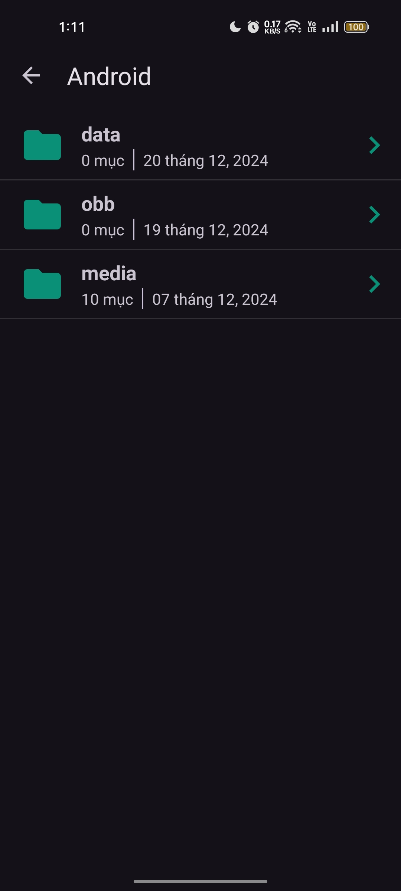
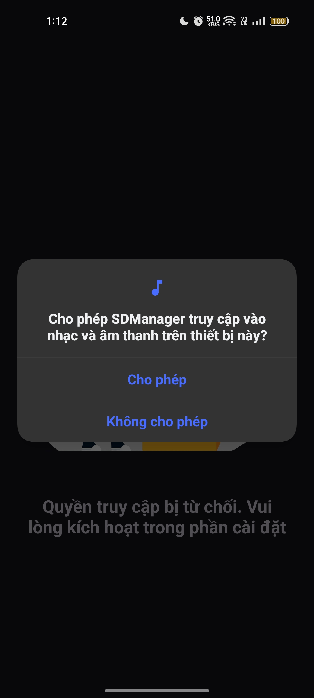

# IT4785 - Developing Mobile Applications

This repository contains demo for a student management app

## UI Layout Result:

---
## Demo Result:
|    Folder content   |  Folder empty |
|:----------------------------------------------------------:|:---------------------------------------------------------:|
|  Ask permission |  Open a file  |

**Course details:** _Developing Mobile Applications - IT4785 - Hanoi University of Science and Technology._

### _Create by Hoang Minh Hai. Nov 2024_
